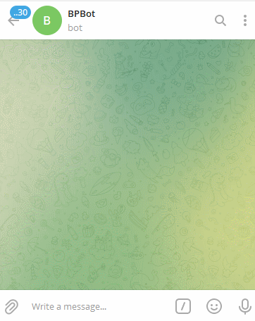

Итоговый проект по ООП.
# Бот-конвертер валют для Телеграм
## pyTelegramBotAPI
 
Автор: **Ширяев КВ**. 
Группа: **FPW-57**.  

Файлы:  
- main.py - бот  
- extensions.py - классы  
- config.py - токен и типы волют  

  

# Как развернуть на Heroku из GitHub

Автор: **Ширяев АК**. 

### 0 Подготовиться

Для этого были заранее добавлены **обязательные** файлы:

- runtime.txt  - выбрана среда выполнения
- requirements.txt  - указаны внешние зависимости Python
- Procfile - указаны тип процесса и команда для запуска файла бота

### 1 Зарегистрироваться

Заполнить форму регистрации на странице https://signup.heroku.com/  
Подтвердить email, письмо придет на почту, может попасть в спам  
Принять [условия](https://dashboard.heroku.com/terms-of-service), если их предлагают принять.

### 2 Создать хранилище/приложение

Перейти на [дашборд](https://dashboard.heroku.com/apps), 👉 "Create new app".  
Заполнить форму на открывшейся странице: "App name" любой, "Choose a region" - `Europe`, 👉 "Create app"

### 3 Привязать аккаунт GitHub  
На [дашборде](https://dashboard.heroku.com/apps) выбрать созданное в пункте выше приложение.  
Вкладка "**Deploy**".  
Раздел "Deployment method", 👉 "GitHub".  
Раздел "Connect to GitHub", 👉 "Connect to GitHub". Произвести вход в аккаунт GitHub.  

### 4 Развернуть бота
Вкладка "**Deploy**".  
Раздел "Connect to GitHub", 👉 "Search". Войти в аккаунт GitHub.  
Напротив нужного найденного репозитория, где хранится телеграмм бот, 👉 "Connect".  
Раздел "Manual deploy". Выбрать ветку, 👉 "Deploy Branc". Ждать сообщение "Your app was successfully deployed."

### 4.1 Добавить токен в переменные конфигурации
***Если в config.py напрямую указан токен телеграмм бота, то пункт 4.1 можно пропустить.***  
В config.py токен берется из словаря переменных окружения:
```python
import os

# telegram bot token
TOKEN = os.environ['TG_BOT_TOKEN']
```
Поэтому необходимо добавить переменную окружения `TG_BOT_TOKEN`.  
Вкладка "**Settings**".
Раздел "Config Vars", 👉 "Reveal Config Vars".  
Указать KEY - `TG_BOT_TOKEN` и VALUE - токен своего телеграмм бота, 👉 "Add".

### 5 Запустить телеграмм бот 
Вкладка "Resources". Напротив "worker python main.py" нажать ✏️, включить ползунок вправо и 👉 "Confirm".  